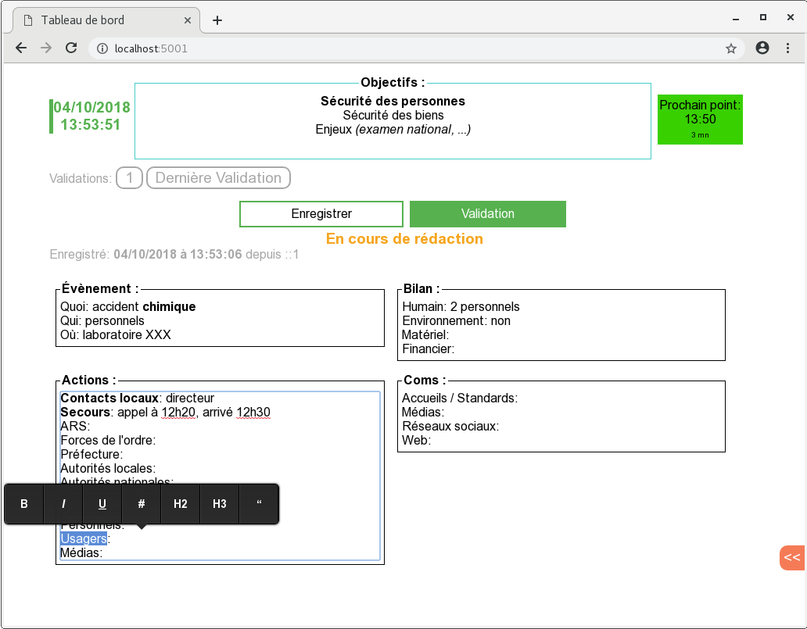

CrisisBoard
=============

[](https://goreportcard.com/report/github.com/yvesago/CrisisBoard)
[](https://travis-ci.org/yvesago/CrisisBoard)
[](https://coveralls.io/github/yvesago/CrisisBoard)


Statut: travail en cours


# Description

``CrisisBoard`` est une application multi-os (Windows, macOS, Linux) pour gérer un «Tableau de bord» et les «Points de Situation» lors d'une situation de crise.


``CrisisBoard`` génère un fichier ``crisisboard.sql`` dans le dossier courant. C'est une simple base de données SQLite.


Exemple lors d'un exercice de crise:




# Fonctionnalités

``CrisisBoard`` est un binaire statique qui contient un serveur web local ainsi que les composants web. Un simple navigateur web standard est suffisant pour l'utiliser.

L'usage d'un serveur web local permet de partager l'affichage et la saisie, sur un réseau local.

# Usage

### Lancement

Il suffit de lancer l'exécutable puis de se connecter avec un navigateur à l'url par défaut : ``http://localhost:5001``

Un menu permet d'afficher l'adresse IP et le mot de passe nécessaire à un accès partagé.

Le fichier ``crisisboard.sql`` du dossier courant peut être conservé comme élément de preuve.

### Tableau de bord

Les blocs «Objectifs», «Évènement», «Actions», «Bilan», «Communications» sont pré-remplis et éditables en ligne.  Ces blocs sont destinés à faire une synthèse de la main courante.

L'enregistrement du tableau de bord force le rafraichissement des navigateurs connectés.


### Point de Situation

Le bloc «Prochain point» permet de saisir, à tout moment, l'heure prévisionnelle du prochain point de situation. À l'heure prévue, et pendant 15 minutes, il est possible de valider le point de situation.

Le menu "Validations:" permet de naviguer dans l'historique des points de situation.


# Construction

La construction de l'application nécessite l'usage d'un compilateur [Go](https://golang.org/)

### Pré-requis


```bash
$ git clone https://github.com/yvesago/CrisisBoard.git
$ cd CrisisBoard/

$ go get -u github.com/jteeuwen/go-bindata/...

$ go get github.com/gin-gonic/gin
$ go get gopkg.in/olahol/melody.v1
$ go get github.com/mattn/go-sqlite3
$ go get gopkg.in/gorp.v1

```


### Construction

L'utilitaire ``go-bindata`` permet de générer le code qui embarque les éléments html.

Le fichier ``web/index.html`` contient le pré-remplissage des blocs.


```
$ go-bindata -o myweb.go web/*

$ go test

```

puis, en fonction de la cible choisie:

```
La bibliothèque sqlite nécessite généralement un cross compilateur spécifique.

Exemples de cross compilation sous linux:

Windows
=======
CC=i686-w64-mingw32-gcc-win32 CGO_ENABLED=1 GOOS=windows GOARCH=386 go build  -ldflags "-s -X main.version=0.0.1" -o CrisisBoard_001_386.exe
CC=x86_64-w64-mingw32-gcc-win32 CGO_ENABLED=1 GOOS=windows GOARCH=amd64 go build  -ldflags "-s -X main.version=0.0.1" -o CrisisBoard_001_amd64.exe

macOS
=====
CC=o64-clang CGO_ENABLED=1 GOOS=darwin GOARCH=amd64 go build  -ldflags "-s -X main.version=0.0.1" -o CrisisBoard_001_darwin_amd64
CC=o32-clang CGO_ENABLED=1 GOOS=darwin GOARCH=386 go build  -ldflags "-s -X main.version=0.0.1" -o CrisisBoard_001_darwin_386

Linux
=====
GOOS=linux GOARCH=amd64 go build  -ldflags "-s -X main.version=0.0.1" -o CrisisBoard_001_linux_amd64
GOOS=linux GOARCH=386 go build  -ldflags "-s -X main.version=0.0.1" -o CrisisBoard_001_linux_386
```

## Limitations

- Pour windows: le binaire n'est pas signé et demande une autorisation d'exécution.
- Pour windows: une demande d'accès réseau doit être validée pour autoriser les accès partagés.
- Tous OS: la communication entre le serveur et le navigateur n'est pas chiffrée. L'usage doit alors être limité à un réseau local de confiance.


## Voir également

- [CrisisLog](https://github.com/yvesago/CrisisLog)
- [CrisisMgmt](https://github.com/yvesago/CrisisMgmt)


## Licence

GPLv3 License

Copyright (c) 2017, 2018 Yves Agostini


